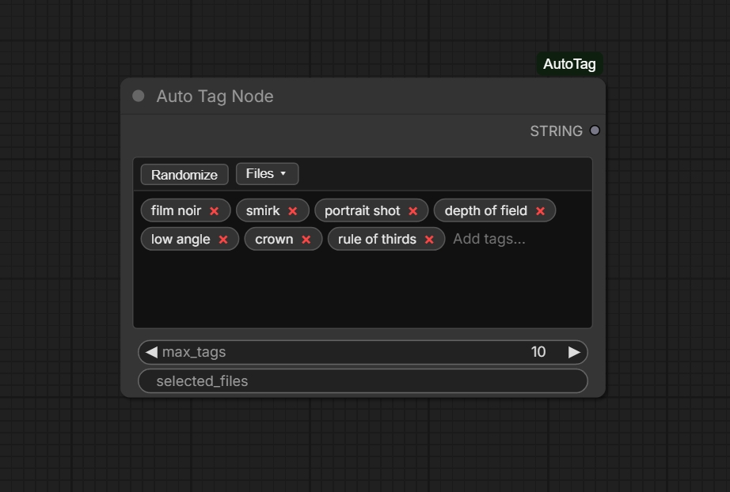

# ComfyUI AutoTag Node

A sophisticated multi-line text node for ComfyUI that provides weighted autocompletion, interactive pill-based tag management, and smart randomization features.

 *(Example preview based on recent implementation)*

## Features

### 🚀 Smart Autocomplete
* **Weighted Suggestions:** Tags are sourced from weighted text files. As you type, the most relevant and high-priority tags appear at the top of the list.
* **Seamless Entry:** Press `Enter` or `,` to instantly convert your typed text into a tag pill.
* **Keyboard Navigation:** Use `Arrow Up/Down` to navigate suggestions and `Enter` to select.

### 💊 Pill-Based Tag Management
* **Interactive UI:** Every tag is displayed as a "pill" with an `×` button for quick removal.
* **Quick Delete:** Press `Backspace` when the input is empty to delete the last tag.
* **Visual Clarity:** Easily see and manage long lists of tags without the clutter of raw text.

### 🎲 Powerful Randomization
* **Randomize Button:** Instantly generate a set of random tags with a single click.
* **Density Control:** Use the `max_tags` input to set a limit (1–100) on how many tags are generated.
* **Category Scoping:** Randomization respects your selected tag files.

### 📁 Multi-File Library
* **File Selection Menu:** Click the "Files ▾" button to choose exactly which tag files to use for suggestions and randomization.
* **Category Scoping:** Organize your tags into specialized files (e.g., `style.txt`, `physical.txt`, `settings.txt`).
* **Easy Customization:** Add your own `.txt` files to the `tags/` folder to instantly expand your library.

## Installation

1. Clone this repository into your ComfyUI `custom_nodes` folder:
   ```bash
   cd ComfyUI/custom_nodes
   git clone https://github.com/your-username/ComfyUI_AutoTag.git
   ```
2. Restart ComfyUI.

## How to Use

1. **Add Node:** Search for "Auto Tag Node" in the ComfyUI node menu (Category: `CustomNodes`).
2. **Type Tags:** Click inside the text area and start typing. Use the autocomplete list to find tags quickly.
3. **Manage Files:** Click the **Files ▾** button to toggle specific categories on or off.
4. **Randomize:** Set a value for `max_tags` and click **Randomize** to instantly populate your prompt with varied concepts.
5. **Connect:** Plug the `STRING` output into any node that accepts text (e.g., CLIP Text Encode).

## Customizing the Tag Library

The node loads all `.txt` files from the `tags/` directory.

### Tag File Format
Each line should contain a tag followed by a comma and a numeric weight:
```text
cyberpunk, 5000
masterpiece, 4500
neon lights, 3000
```
* **Higher Weights** appear first in the autocomplete list.
* **Weights** can be any integer.

### Default Categories Provided
* **`style.txt`**: Artistic mediums, aesthetics, and art styles.
* **`physical.txt`**: Character traits, clothing, and expressions.
* **`settings.txt`**: Environments, locations, and backgrounds.
* **`composition.txt`**: Camera angles, lighting, and technical details.

## License
MIT
